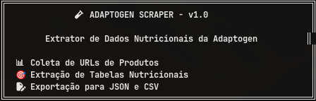
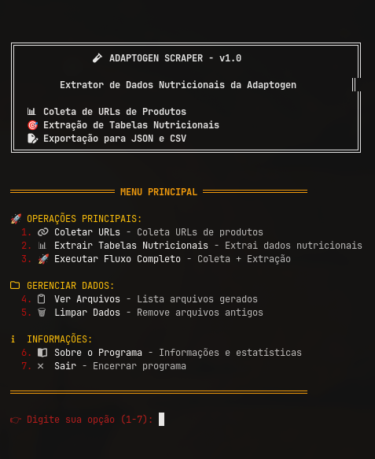

<!-- Repositório: https://github.com/sidnei-almeida/adaptogen_scraper -->
<p align="center">
  
</p>

<h1 align="center">adaptogen-scraper</h1>

<p align="center">
  <strong>CLI para coletar URLs de produtos em adaptogen.com.br e extrair tabelas nutricionais para JSON e CSV.</strong>
</p>

<p align="center">
  <a href="https://www.python.org/downloads/"></a>
  
  
  
</p>

<p align="center">
  <a href="#visão-geral">Visão geral</a> ·
  <a href="#galeria">Galeria</a> ·
  <a href="#recursos">Recursos</a> ·
  <a href="#requisitos">Requisitos</a> ·
  <a href="#instalação--início-rápido">Início rápido</a> ·
  <a href="#referência-da-cli">CLI</a> ·
  <a href="#pipeline-de-dados">Dados</a> ·
  <a href="#estrutura-do-projeto">Layout</a> ·
  <a href="#solução-de-problemas">Troubleshooting</a> ·
  <a href="#autor">Autor</a> ·
  <a href="#licença">Licença</a>
</p>

---

## Visão geral

**adaptogen-scraper** automatiza dois passos: **descobrir links de páginas de produto** no e-commerce Adaptogen e **ler a tabela nutricional** exibida em cada ficha (`div.flow` → `table`), normalizando números e exportando um CSV único para análise.

| Etapa | Resultado |
|--------|-----------|
| **Coleta de URLs** | Gera [`json/produtos_urls.json`](json/produtos_urls.json) com listas por categoria (pré-treino, snacks, proteínas com paginação, creatinas). |
| **Extração nutricional** | Percorre cada URL e grava [`dados_extraidos/produtos_nutricionais.csv`](dados_extraidos/produtos_nutricionais.csv) com porção, macros e metadados. |
| **Interface** | Menu interativo em [`main.py`](main.py): fluxo guiado, listagem de arquivos gerados e limpeza segura dos dados locais. |

O scraper usa **User-Agent e cabeçalhos de navegador** e **`REQUEST_DELAY` de 2 s** entre requisições (`url_collector.py` / `nutritional_scraper.py`) para reduzir carga no servidor. Este repositório é **somente uso pessoal e educativo** — respeite os termos do site e a legislação aplicável ao fazer scraping.

---

## Galeria

### Banner da CLI

<p align="center">
  
</p>

<p align="center">
  <em><strong>Figura 1.</strong> Cabeçalho do programa: versão, escopo e atalhos das operações principais.</em>
</p>

### Menu completo

<p align="center">
  
</p>

<p align="center">
  <em><strong>Figura 2.</strong> Menu interativo: coleta, extração, fluxo completo, arquivos, limpar dados, sobre e sair.</em>
</p>

---

## Recursos

| Área | Descrição |
|------|-----------|
| **CLI colorida** | Banner, menu numerado e confirmações para operações lentas ou destrutivas (limpar dados exige digitar `CONFIRMAR`). |
| **Paginação** | Categoria **proteínas** percorre `?sf_paged=` até aparecer «Nenhum produto encontrado». |
| **Parsing da tabela** | Foco na estrutura WooCommerce da Adaptogen; mapeamento de nutrientes e extração resiliente da **porção** no `<thead>`/primeira linha. |
| **Saídas** | JSON por categorias; CSV único com timestamp de coleta (`data_coleta`) e `categoria`. |
| **Scripts soltos** | [`url_collector.py`](url_collector.py) e [`nutritional_scraper.py`](nutritional_scraper.py) podem rodar direto no terminal ou serem disparados pelo `main.py`. |
| **Template opcional** | [`template_main.py`](template_main.py) é um modelo reutilizável de CLI no mesmo estilo visual. |

---

## Requisitos

| Componente | Observações |
|------------|-------------|
| **Python** | 3.10 ou superior recomendável (compatível em geral com 3.x recente). |
| **Pacotes** | `requests`, `beautifulsoup4`, `lxml` — pin mínimos em [`requirements.txt`](requirements.txt). |
| **Rede** | Acesso HTTPS a **adaptogen.com.br**; timeout de 30 s por página. |

> **Observação:** mudanças no HTML/CSS do tema ou na URL de categorias podem exigir ajustes nos seletores em [`url_collector.py`](url_collector.py) e [`nutritional_scraper.py`](nutritional_scraper.py).

---

## Instalação & início rápido

```bash
git clone https://github.com/sidnei-almeida/adaptogen_scraper.git
cd adaptogen_scraper

python -m venv venv
source venv/bin/activate   # Linux/macOS

pip install -r requirements.txt

python main.py
```

Para um único ciclo ponta-a-ponta, use **opção 3 — Executar Fluxo Completo** (primeiro URLs, depois nutricional).

---

## Referência da CLI

### Menu interativo (recomendado)

```bash
python main.py
```

| Opção | Função |
|-------|--------|
| **1** | Coleta de URLs → `json/produtos_urls.json` |
| **2** | Extração nutricional (requer JSON da etapa 1) → CSV |
| **3** | Fluxo completo: 1 seguido de 2 |
| **4** | Lista JSONs em `json/` e CSVs em `dados_extraidos/` |
| **5** | Remove arquivos gerados após confirmar `CONFIRMAR` |
| **6** | Texto “Sobre” com estatísticas e stack |
| **7** | Sair |

### Sem menu (automático / cron)

Mesma ordem que a opção **3**:

```bash
python url_collector.py
python nutritional_scraper.py
```

---

## Pipeline de dados

### JSON (`json/produtos_urls.json`)

Estrutura: chaves das categorias e listas de URLs absolutas:

```json
{
  "pre-treino": ["https://…"],
  "snacks": ["https://…"],
  "proteinas": ["https://…"],
  "creatinas": ["https://…"]
}
```

### CSV (`dados_extraidos/produtos_nutricionais.csv`)

Colunas exportadas pelo [`nutritional_scraper.py`](nutritional_scraper.py):

| Coluna | Conteúdo |
|--------|----------|
| `nome`, `url` | Título na página (`h1`/seletores de produto) e link visitado |
| `porcao` | Texto da porção (ex.: dose em g/unidade) quando detectável |
| `calorias` … `sodio` | Valores numéricos; ausentes são normalizados para **0** |
| `data_coleta` | Data e hora no momento da extração da linha |
| `categoria` | Chave herdada do JSON (`pre-treino`, `snacks`, etc.) |

---

## Estrutura do projeto

```
.
├── main.py                   # CLI interativa (ponto de entrada principal)
├── url_collector.py          # Coleta de URLs por categoria → JSON
├── nutritional_scraper.py    # Extrai tabelas → CSV
├── template_main.py          # Template de CLI (“esqueleto” reaproveitável)
├── json/                     # produtos_urls.json (criado ao rodar coleta)
├── dados_extraidos/          # produtos_nutricionais.csv (criado na extração)
├── images/
│   ├── logo.png              # Hero / screenshot do banner da CLI
│   └── software.png          # Captura do menu completo
├── requirements.txt
└── README.md
```

Pastas `json/` e `dados_extraidos/` podem estar vazias ou ausentes até a primeira execução — o próprio fluxo os utiliza quando grava os arquivos.

---

## Solução de problemas

| Sintoma | O que verificar |
|---------|-------------------|
| `json/produtos_urls.json não encontrado` na opção 2 | Rode a opção **1** ou `python url_collector.py` antes da extração. |
| Lista vazia de URLs em alguma categoria | O site pode ter mudado classes (`woocommerce-LoopProduct-link`) ou rotas; inspecionar HTML atual. |
| «Tabela nutricional não encontrada» nos logs | A ficha pode não usar `div.flow` + `table` como esperado; ajustar `parse_nutritional_table`. |
| Lentidão / bloqueios HTTP | Mantenha o delay entre requisições; conferir firewall, TLS e se o servidor retorna `429`/`403`. |
| Produtos repetidos ou faltantes em proteínas | O coletor remove duplicatas no fim (`set`); páginas vazias interrompem a paginação. |

---

## Autor

| | |
| --- | --- |
| **Mantenedor** | [Sidnei Almeida](https://github.com/sidnei-almeida) ([@sidnei-almeida](https://github.com/sidnei-almeida)) |
| **Repositório** | [github.com/sidnei-almeida/adaptogen_scraper](https://github.com/sidnei-almeida/adaptogen_scraper) |
| **LinkedIn** | [linkedin.com/in/saaelmeida93](https://www.linkedin.com/in/saaelmeida93/) |

---

## Contribuindo

Issues e PRs são bem-vindos. Ao reportar falhas de scraping, inclua **trecho da página/HTML** ou **mensagem do log**, além das versões de **Python**, `beautifulsoup4` e `lxml`.

---

## Licença

Projeto disponível como **código aberto para uso pessoal e educacional**. Não há arquivo `LICENSE` no repositório no momento — se precisar de uma licença explícita (por exemplo MIT), adicione o ficheiro e atualize esta secção.

---

<p align="center">
  <sub>Este projeto não é afiliado, endossado ou mantido pela Adaptogen ou por qualquer marca associada aos produtos raspados.</sub>
</p>
